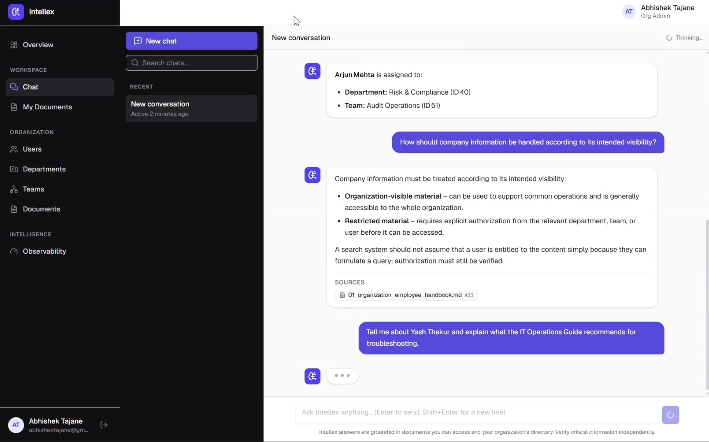
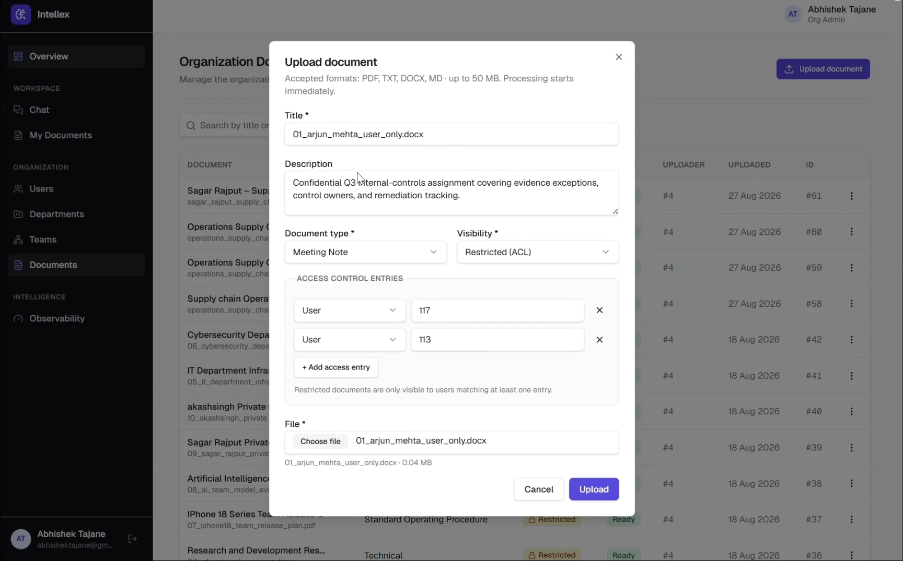
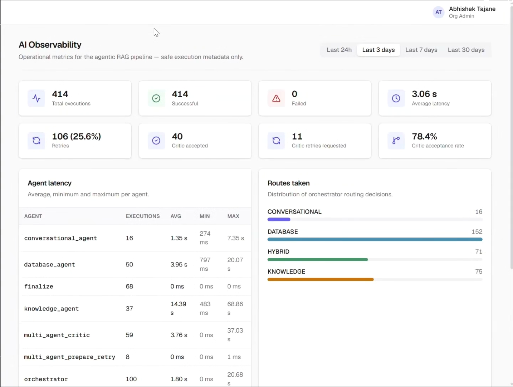
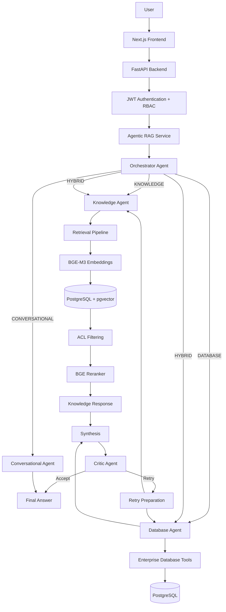

# Intellex — Enterprise AI Knowledge Platform

> **A multi-agent enterprise AI knowledge platform that combines secure document intelligence with organizational data.**

Intellex enables users to ask natural-language questions across internal documents and organizational data while enforcing access permissions during retrieval.

Instead of sending every question through a single RAG pipeline, Intellex uses a **LangGraph-powered multi-agent architecture** to determine whether a query requires document knowledge, structured organizational data, both, or a simple conversational response.

---

## Demo

### Core System Demo

This demonstration showcases the main Intellex workflow, including Multi Agent RAG Chat, document intelligence, ACL-aware access control, document upload, and multi-agent observability.

https://github.com/user-attachments/assets/7508d6bc-77a2-4a4d-826b-7f84227ee9d7

### Organization Management Demo

This demonstration showcases organizational data management, including users, departments, and teams.

https://github.com/user-attachments/assets/efcccb73-652e-4bb1-a8f2-7122554e6ab4

---

## Project Preview

> Add your project screenshots inside a folder such as `docs/images/`.

### Chat Workspace



### Hybrid AI Response


### Document Processing



### Observability Dashboard



---

# Overview

Enterprise knowledge is often scattered across:

* PDFs
* Word documents
* Markdown files
* Internal documentation
* Organizational databases
* Departments and teams

Traditional search systems struggle to understand natural-language questions and often treat access control as an afterthought.

**Intellex solves this by combining:**

* Multi-agent AI orchestration
* Retrieval-Augmented Generation (RAG)
* ACL-aware vector retrieval
* Organizational database intelligence
* Hybrid document and database queries
* Self-correcting answer generation

---

# Key Features

## Multi-Agent Query Routing

Intellex automatically classifies each query and routes it to the appropriate execution path.

| Query Type         | Description                                          |
| ------------------ | ---------------------------------------------------- |
| **Knowledge**      | Answers questions using internal documents           |
| **Database**       | Retrieves structured organizational data             |
| **Hybrid**         | Combines document knowledge and database information |
| **Conversational** | Handles simple conversational queries                |

---

## Enterprise RAG System

The knowledge pipeline retrieves relevant information from internal documents using:

* BGE-M3 Embeddings
* PostgreSQL + pgvector
* ACL-aware retrieval
* BGE Reranking
* LLM-based answer generation

### Retrieval Flow

```text
User Question
      ↓
BGE-M3 Embedding
      ↓
pgvector Similarity Search
      ↓
ACL Permission Filtering
      ↓
Candidate Chunks
      ↓
BGE-Reranker-v2-M3
      ↓
Top Relevant Context
      ↓
LLM Generation
      ↓
Answer + Sources
```

---

## ACL-Aware Retrieval

Security is enforced directly during retrieval.

The system considers:

* Organization membership
* User-level permissions
* Team-level permissions
* Department-level permissions
* Organization admin permissions
* Document visibility

### Document Visibility

```text
ORGANIZATION
    ↓
Accessible to authorized organization members

RESTRICTED
    ↓
Requires matching ACL permissions
```

This ensures unauthorized document chunks are filtered **before they become AI context**.

---

## Hybrid Intelligence

Some enterprise questions require information from multiple sources.

For example:

> **"What is the Engineering deployment SOP and who is responsible for it?"**

This query may require:

```text
Internal Documents
        +
Organizational Database
        ↓
    Synthesis
        ↓
   Final Answer
```

Intellex can execute both the **Knowledge Agent** and **Database Agent**, then combine their outputs.

---

## Self-Correcting AI Workflow

Hybrid answers pass through a **Critic Agent** before being finalized.

The critic evaluates:

* Context relevance
* Faithfulness
* Answer correctness

### Workflow

```text
Generate Answer
      ↓
Critic Agent
      ↓
┌───────────────┐
│ Quality Check │
└───────┬───────┘
        │
   ┌────┴────┐
   ↓         ↓
ACCEPT     RETRY
   │         │
   ↓         ↓
Final    Improved
Answer   Retrieval
```

If the answer does not meet the required quality threshold, the system can retry the relevant retrieval path.

---

# System Architecture



---

# End-to-End Query Flow

```text
1. User submits a question
          ↓
2. FastAPI receives the request
          ↓
3. JWT authentication validates the user
          ↓
4. AgenticRAGService starts the workflow
          ↓
5. LangGraph Orchestrator classifies the query
          ↓
6. Specialist agent(s) execute
          ↓

      KNOWLEDGE
          ↓
   Vector Retrieval
          ↓
    ACL Filtering
          ↓
      Reranking
          ↓
    LLM Generation

      DATABASE
          ↓
   Enterprise Tools
          ↓
 PostgreSQL Queries

      HYBRID
          ↓
Knowledge + Database
          ↓
      Synthesis
          ↓
     Critic Agent

          ↓
7. Final Answer
          ↓
8. Sources + Execution Information
          ↓
9. Frontend renders the response
```

---

# Document Ingestion Pipeline

Intellex processes uploaded documents through a structured pipeline.

```text
Document Upload
       ↓
Content Extraction
       ↓
Content Cleaning
       ↓
Structure Detection
       ↓
Chunking Strategy Selection
       ↓
┌───────────────┬────────────────┬───────────────┐
↓               ↓                ↓
Narrative      Tables            Code
Chunking       Chunking          Chunking
└───────────────┴────────────────┴───────────────┘
       ↓
Metadata Enrichment
       ↓
Security Context
       ↓
BGE-M3 Embeddings
       ↓
PostgreSQL + pgvector
```

---

## Supported Document Types

Intellex supports document ingestion for formats including:

* PDF
* DOCX
* Markdown
* TXT

The system uses structure-aware processing to handle different types of content.

---

# Multi-Agent System

## 1. Orchestrator Agent

The Orchestrator is responsible for understanding the user's request and selecting the appropriate route.

### Possible routes

```text
KNOWLEDGE
DATABASE
HYBRID
CONVERSATIONAL
```

---

## 2. Knowledge Agent

Responsible for answering questions using internal documents.

### Responsibilities

* Query processing
* Embedding generation
* Vector retrieval
* ACL filtering
* Reranking
* Context construction
* Answer generation
* Source attribution

---

## 3. Database Agent

The Database Agent retrieves structured organizational information.

It can query enterprise data such as:

* Users
* Organizations
* Departments
* Teams

The agent uses organization-scoped tools to ensure data isolation.

---

## 4. Conversational Agent

Handles simple requests that do not require:

* Document retrieval
* Database queries
* Complex multi-agent execution

This avoids unnecessary processing for simple conversational interactions.

---

## 5. Critic Agent

The Critic Agent evaluates generated answers.

It checks:

| Metric            | Purpose                                          |
| ----------------- | ------------------------------------------------ |
| Context Relevance | Is the retrieved information relevant?           |
| Faithfulness      | Is the answer grounded in the available context? |
| Correctness       | Does the answer properly address the question?   |

Weak answers can trigger a controlled retry process.

---

# Database Architecture

Intellex uses **PostgreSQL with pgvector** for both relational and vector data.

## Core Entities

| Entity             | Purpose                                   |
| ------------------ | ----------------------------------------- |
| `organizations`    | Multi-tenant organization root            |
| `departments`      | Organizational departments                |
| `teams`            | Teams within the organization             |
| `users`            | Users, roles, and organization membership |
| `documents`        | Uploaded document metadata                |
| `document_chunks`  | Document chunks and embeddings            |
| `document_acls`    | Fine-grained document permissions         |
| `chat_sessions`    | User conversation sessions                |
| `chat_history`     | Stored chat messages                      |
| `agent_executions` | Agent observability data                  |

---

# Multi-Tenant Architecture

Intellex follows an organization-centered hierarchy.

```text
Organization
│
├── Departments
│      │
│      └── Teams
│             │
│             └── Users
│
└── Documents
       │
       ├── Document Chunks
       │
       └── Document ACLs
```

Every relevant operation is scoped to the user's organization.

---

# Role-Based Access Control

The system supports multiple access levels.

```text
SUPER_ADMIN
      ↓
Platform-level administration

ORG_ADMIN
      ↓
Organization-level administration

EMPLOYEE
      ↓
Authorized enterprise knowledge access
```

---

# Observability

Intellex captures information about agent execution.

This can include:

* Agent name
* Query route
* Execution status
* Attempt number
* Latency
* Request identifiers
* Session identifiers
* Execution details

This helps make multi-agent behavior observable and easier to debug.

---

# Performance Optimizations

The system includes mechanisms to reduce unnecessary computation.

### Key optimizations

* Embedding caching
* Retrieval result caching
* pgvector similarity search
* Candidate retrieval before reranking
* Organization-scoped database queries

The reranker operates on a smaller candidate set instead of processing the entire document collection.

---

# Technology Stack

## Backend

* Python
* FastAPI
* SQLAlchemy
* Alembic

## AI and Agent Framework

* LangGraph
* LangChain
* BGE-M3
* BGE-Reranker-v2-M3

## LLM Providers

The project supports configurable LLM integrations, including:

* OpenRouter
* Groq
* Ollama

## Database

* PostgreSQL
* pgvector
* Supabase

## Frontend

* Next.js 15
* React 19
* TypeScript
* TanStack Query

## Security

* JWT Authentication
* Argon2 Password Hashing
* RBAC
* Document ACLs

---

# Project Structure

```text
Intellex/
│
├── app/
│   │
│   ├── agents/
│   │   ├── graph/
│   │   ├── tools/
│   │   ├── orchestrator_agent.py
│   │   ├── database_agent.py
│   │   ├── critic_agent.py
│   │   └── multi_agent_state.py
│   │
│   ├── api/
│   │
│   ├── core/
│   │
│   ├── database/
│   │
│   ├── dependencies/
│   │
│   ├── dto/
│   │
│   ├── enums/
│   │
│   ├── evaluation/
│   │
│   ├── models/
│   │
│   ├── schemas/
│   │
│   └── services/
│       │
│       ├── embedding/
│       ├── generation/
│       ├── retrieval/
│       ├── pipeline/
│       ├── chunking/
│       ├── cleaning/
│       ├── rag/
│       ├── reranking/
│       └── observability/
│
├── frontend/
│
├── evaluation/
│
├── alembic/
│
├── storage/
│
├── requirements.txt
│
└── README.md
```

---

# Retrieval Evaluation

The project includes retrieval evaluation tooling for measuring retrieval quality.

Metrics include:

* Hit@K
* Precision@K
* Recall@K
* MRR

These metrics help evaluate retrieval performance independently from the final LLM response.

---

# Example Queries

## Knowledge Query

> **What is the company's expense reimbursement policy?**

The system retrieves relevant internal document content.

---

## Database Query

> **Who is in the Engineering department?**

The system routes the request to the Database Agent.

---

## Hybrid Query

> **What is the Engineering deployment SOP and who is responsible for it?**

The system combines:

```text
Knowledge Agent
        +
Database Agent
        ↓
    Synthesis
        ↓
   Critic Agent
        ↓
   Final Answer
```

---

## Conversational Query

> **Hi, thanks!**

The request can be handled without unnecessary retrieval.

---

# Local Setup

## Prerequisites

Make sure you have:

* Python 3.x
* Node.js
* PostgreSQL or Supabase with pgvector
* Required LLM provider credentials or Ollama

---

## Backend Setup

Clone the repository:

```bash
git clone https://github.com/abhishek24-06/Intellex-Enterprise-AI-Knowledge-Platform.git

cd Intellex-Enterprise-AI-Knowledge-Platform
```

Create and activate a virtual environment:

### Windows

```bash
python -m venv .venv

.venv\Scripts\activate
```

### macOS/Linux

```bash
python -m venv .venv

source .venv/bin/activate
```

Install dependencies:

```bash
pip install -r requirements.txt
```

Create your environment file:

```bash
cp .env.example .env
```

Configure your:

* Database connection
* JWT settings
* LLM provider settings
* API keys

Run database migrations:

```bash
alembic upgrade head
```

Start the backend:

```bash
uvicorn app.main:app --reload
```

---

# Frontend Setup

Navigate to the frontend:

```bash
cd frontend
```

Install dependencies:

```bash
npm install
```

Start the development server:

```bash
npm run dev
```

---

# API Documentation

FastAPI automatically provides interactive API documentation.

After starting the backend, open:

```text
http://localhost:8000/docs
```

---

# Key Engineering Decisions

## Why LangGraph?

The system requires:

* Stateful execution
* Conditional routing
* Multi-agent orchestration
* Retry logic
* Parallel hybrid workflows

LangGraph provides explicit control over these workflows.

---

## Why PostgreSQL + pgvector?

Using PostgreSQL for both relational and vector data allows the system to combine:

* Organizational data
* Document metadata
* Permissions
* Vector embeddings

This is especially useful for applying **ACL rules during vector retrieval**.

---

## Why a Reranker?

Vector similarity retrieves candidate chunks efficiently.

The reranker then evaluates those candidates more deeply and selects the most relevant context.

```text
Fast Retrieval
      ↓
Candidate Chunks
      ↓
More Accurate Reranking
      ↓
Best Context
```

---

## Why a Critic Agent?

Hybrid answers combine information from multiple sources.

The Critic Agent provides an additional quality check before the answer is finalized.

This allows the system to retry weak answers instead of accepting every generated response immediately.

---

# Future Improvements

Potential improvements include:

* True token-level streaming
* More automated test coverage
* API rate limiting
* Health and readiness endpoints
* Configurable critic thresholds
* Document version history
* Document comparison
* Improved deletion workflows
* Enterprise SSO
* Expanded analytics
* Advanced administration features

---

# Demo Checklist

When recording the project demo, consider showing:

* [ ] Login and authentication
* [ ] Knowledge-based query
* [ ] Database query
* [ ] Hybrid query
* [ ] Source citations
* [ ] Document upload
* [ ] Document processing
* [ ] Restricted document access
* [ ] Different user permissions
* [ ] Chat session history
* [ ] Observability dashboard
* [ ] Multi-agent workflow

---

# Recommended Screenshots

Store screenshots in:

```text
docs/images/
```

Recommended files:

```text
docs/images/
│
├── chat-workspace.png
├── hybrid-answer.png
├── source-citations.png
├── document-upload.png
├── admin-documents.png
├── observability.png
├── acl-demo.png
├── architecture-diagram.png
├── session-history.png
└── mobile-chat.png
```

---

# Security Checklist

Before sharing the repository publicly:

* [ ] Do not commit `.env`
* [ ] Remove API keys
* [ ] Remove database passwords
* [ ] Remove JWT secrets
* [ ] Remove private documents
* [ ] Ignore `node_modules`
* [ ] Ignore `.venv`
* [ ] Ignore cache files
* [ ] Ignore unnecessary generated files
* [ ] Ensure screenshots do not expose sensitive information

---

# Author

**Abhishek**

GitHub: [@abhishek24-06](https://github.com/abhishek24-06)

---

# Project Status

**Completed**

Intellex demonstrates how an enterprise AI system can combine:

* Retrieval-Augmented Generation
* Multi-agent orchestration
* Organizational intelligence
* Secure vector retrieval
* Fine-grained access control
* Self-correcting AI workflows

into a unified enterprise knowledge platform.

---

If you found this project interesting, consider giving the repository a star.
